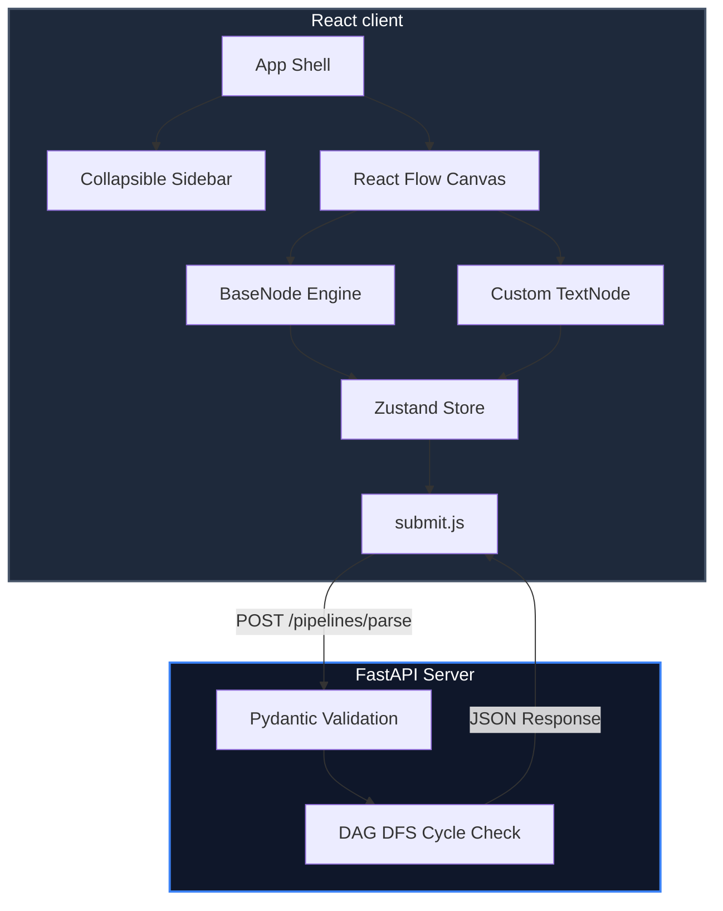

# ⌁ Visual Pipeline Builder

A professional, enterprise-grade node-based workflow editor built on **React + React Flow** (Frontend) and **Python + FastAPI** (Backend). Drag-and-drop workflow components, connect dynamic data streams, and perform high-performance cycle checks (DAG validation) instantly.


---

## 🏗 System Architecture



---

## ✦ Key Features & Implementation Deep-Dives

### 1. Declarative BaseNode Abstraction Engine
Rather than repeating layout boilerplate across multiple custom nodes, the project features a custom metadata-driven factory in [BaseNode.js](file:///C:/Users/Realme/OneDrive/Desktop/Fake/workspace-9464275e-a735-40a6-9e6b-aad941a5c0fd/frontend/src/nodes/BaseNode.js). It accepts a schema configuration and returns a React Flow component:
- **Automatic Field Renderers:** Dynamically instantiates inputs (`text`, `textarea`, `number`, `select`), statuses (`stat`), and customized elements.
- **Unified Style Systems:** Centralizes handle connections and colors using CSS variables (`var(--node-*)`).
- **sensible Defaults:** Exposes standard initialization methods inside `nodes/index.js` to automatically supply configurations for Input, Output, LLM, Timer, Email, Filter, Merge, and Debug nodes.

### 2. Live Dynamic Handles (Text Node)
Implemented inside [TextNode.js](file:///C:/Users/Realme/OneDrive/Desktop/Fake/workspace-9464275e-a735-40a6-9e6b-aad941a5c0fd/frontend/src/nodes/TextNode.js), the canvas listens to text inputs and matches the double curly-brace format `{{ variable_name }}`:
- **Variable Sanitization:** Restricts variables using a strict JavaScript identifier filter: `/\{\{\s*([A-Za-z_$][\w$]*)\s*\}\}/g`, protecting handles from script injections.
- **Dynamic Handle Spawning:** Spawns a labeled target connection point on the left side of the card for each detected unique variable.
- **Orphaned Edge Cleanup:** The Zustand state monitor in [pipelineStore.js](file:///C:/Users/Realme/OneDrive/Desktop/Fake/workspace-9464275e-a735-40a6-9e6b-aad941a5c0fd/frontend/src/store/pipelineStore.js) automatically cleans up connected edges when a variable is deleted from the text input.

### 3. Space-Optimized Collapsible Sidebar
- The sidebar panel houses draggable nodes and can be completely hidden using a vector-based toggle button.
- Transitions use custom `cubic-bezier(0.4, 0, 0.2, 1)` easing equations for high-fidelity animations.
- The canvas expands automatically to maximize screen space for building complex structures.

### 4. High-Performance DAG Cycle Detection
In [main.py](file:///C:/Users/Realme/OneDrive/Desktop/Fake/workspace-9464275e-a735-40a6-9e6b-aad941a5c0fd/backend/main.py), cycles are detected using an **iterative 3-color Depth First Search (DFS)** algorithm. Iterative processing prevents recursion-limit crashes (`RecursionError`) on complex topologies:

| Color State | Meaning | Action |
|---|---|---|
| **WHITE (0)** | Unvisited | Node is ready for exploration. |
| **GRAY (1)** | Active (On Stack) | Recursion path is tracing through this node. **Encountering a GRAY node reveals a back-edge (loop).** |
| **BLACK (2)** | Explored | Node and all its subpaths have been fully verified. |

---

## 🔒 Security Hardening

- **XSS & Injection Shielding:** Variable regex strictly filters inputs, and react DOM rendering natively sanitizes strings to prevent inline script executions.
- **DoS Mitigation:** Stated limits restrict payloads to `10,000` nodes and `50,000` edges per analysis request.
- **CORS Protection:** Configurable whitelist checks block requests originating from unauthorized endpoints while supporting developer localhost environments.
- **Information Masking:** Production errors return a safe `500 Internal server error` to protect backend stack trace details, which are logged securely on the host.

---

## 🚀 Installation & Local Run

### Prerequisites
- **Node.js** ≥ 18
- **Python** ≥ 3.10

### 1. Backend Service Setup (FastAPI)
```bash
cd backend

# Create and activate python virtual environment
python -m venv .venv
source .venv/bin/activate      # Windows: .venv\Scripts\activate

# Install requirements
pip install -r requirements.txt

# Start the ASGI server
python -m uvicorn main:app --reload --host 127.0.0.1 --port 8000
```
- Swagger documentation page: [http://localhost:8000/docs](http://localhost:8000/docs)
- Uptime health check: [http://localhost:8000/health](http://localhost:8000/health)

### 2. Frontend client Setup (React)
```bash
cd frontend

# Install package dependencies
npm install

# Run the dev server
npm start
```
- Local client URL: [http://localhost:3000](http://localhost:3000)

---

## 🔧 Environment Variables

### Frontend Configurations (`frontend/.env`)
- `REACT_APP_API_URL` (Default: `http://localhost:8000`): Base URL pointing to the FastAPI API gateway.
- `PORT` (Default: `3000`): Port for the local Webpack dev-server.
- `BROWSER` (Default: `none`): Prevents browser popups on start.

### Backend Configurations (`backend/.env`)
- `ALLOWED_ORIGINS` (Default: `http://localhost:3000`): Allowed CORS origins.
- `HOST` (Default: `0.0.0.0`): Bind address.
- `PORT` (Default: `8000`): Bind port.
- `LOG_LEVEL` (Default: `INFO`): Logging verbosity (DEBUG, INFO, WARNING, ERROR).

---

## 📡 API Reference

### `POST /pipelines/parse`
Parses and checks workflow graph topology.

**Request Schema:**
```json
{
  "nodes": [
    { "id": "input_1", "type": "input" },
    { "id": "llm_1", "type": "llm" }
  ],
  "edges": [
    { "source": "input_1", "target": "llm_1" }
  ]
}
```

**Success Response (200 OK):**
```json
{
  "num_nodes": 2,
  "num_edges": 1,
  "is_dag": true
}
```
